# Design Document: Stock Tracking Assistant

## Overview

The Stock Tracking Assistant is a real-time options trading analysis system that helps users track positions and identify optimal timing for three strategies: LEAPS (long-term growth), PMCC (Poor Man's Covered Call), and the Wheel strategy. The system fetches real-time market data from Massive API (Polygon.io), performs technical analysis, generates trading signals, and presents actionable recommendations through a mobile-friendly web interface.

### Key Design Principles

1. **Real-time First**: No persistent database - all data fetched on-demand with Redis caching
2. **Flexible Watchlist**: Support any ticker, not hardcoded to specific stocks
3. **Strategy-Focused UI**: Organize by stock → strategy → position/signals
4. **Mobile-Optimized**: Touch-friendly interface for iPhone 15 (390px width)
5. **Existing Architecture**: Integrate with mojo-api (FastAPI) and mojo-next (Next.js)

## Architecture

### High-Level System Architecture


### Component Architecture


## Components and Interfaces

### Backend Components (mojo-api)

#### 1. API Routers

**Public Router**: `mojo-api/api/routers/finance_router.py`

```python
from fastapi import APIRouter, Depends
from api.handlers.finance_handler import FinanceHandler
from api.factories.handler_factory import get_finance_handler

router = APIRouter(prefix="/finance", tags=["finance"])

# Public endpoints (no auth required)
@router.get("/dashboard")
async def get_dashboard(
    handler: FinanceHandler = Depends(get_finance_handler)
):
    return await handler.get_dashboard()

@router.get("/watchlist")
async def get_watchlist(
    handler: FinanceHandler = Depends(get_finance_handler)
):
    return handler.get_watchlist()

@router.post("/watchlist")
async def add_ticker(
    ticker: str,
    handler: FinanceHandler = Depends(get_finance_handler)
):
    return handler.add_ticker(ticker)

@router.delete("/watchlist/{ticker}")
async def remove_ticker(
    ticker: str,
    handler: FinanceHandler = Depends(get_finance_handler)
):
    return handler.remove_ticker(ticker)
```

**Protected Router**: `mojo-api/api/routers/internal/finance_router.py`

```python
from fastapi import APIRouter, Depends
from api.handlers.finance_handler import FinanceHandler
from api.factories.handler_factory import get_finance_handler

router = APIRouter(tags=["finance-internal"])

# Protected endpoints (auth required)
@router.get("/portfolio/positions")
async def get_positions(
    handler: FinanceHandler = Depends(get_finance_handler)
):
    return handler.get_positions()

@router.post("/portfolio/positions")
async def add_position(
    position: PositionCreate,
    handler: FinanceHandler = Depends(get_finance_handler)
):
    return await handler.add_position(position)

@router.put("/portfolio/positions/{id}")
async def update_position(
    id: str,
    position: PositionUpdate,
    handler: FinanceHandler = Depends(get_finance_handler)
):
    return handler.update_position(id, position)

@router.delete("/portfolio/positions/{id}")
async def delete_position(
    id: str,
    handler: FinanceHandler = Depends(get_finance_handler)
):
    return handler.delete_position(id)
```

#### 2. Handlers

**Location**: `mojo-api/api/handlers/finance_handler.py`

```python
from api.dao.finance_dao import FinanceDAO
from api.lib.stock_tracking.services.market_data_service import MarketDataService
from api.lib.stock_tracking.services.signal_generator_service import SignalGeneratorService

class FinanceHandler:
    def __init__(
        self,
        finance_dao: FinanceDAO,
        market_data_service: MarketDataService,
        signal_generator_service: SignalGeneratorService
    ):
        self.finance_dao = finance_dao  # Injected via Depends
        self.market_data_service = market_data_service
        self.signal_generator_service = signal_generator_service
    
    async def get_dashboard(self) -> DashboardResponse:
        """Get complete dashboard data for all watchlist tickers"""
        # Get watchlist from DAO
        tickers = self.finance_dao.get_watchlist()
        
        # Fetch and process data for each ticker
        stocks_data = []
        for ticker in tickers:
            stock_data = await self.market_data_service.get_stock_data(ticker)
            options_data = await self.market_data_service.get_options_chain(ticker)
            
            # Generate signals
            signals = self.signal_generator_service.generate_all_signals(
                stock_data, options_data
            )
            
            # Get positions
            positions = self.finance_dao.get_positions_for_ticker(ticker)
            
            stocks_data.append({
                "ticker": ticker,
                "stock_data": stock_data,
                "strategy_data": {
                    "signals": signals,
                    "positions": positions
                }
            })
        
        return DashboardResponse(stocks=stocks_data)
    
    def get_watchlist(self) -> List[str]:
        """Get list of tickers in watchlist"""
        return self.finance_dao.get_watchlist()
    
    def add_ticker(self, ticker: str) -> dict:
        """Add ticker to watchlist"""
        # Validate ticker exists via Massive API
        if not self.market_data_service.validate_ticker(ticker):
            raise ValueError(f"Ticker {ticker} not found")
        
        # Check if already in watchlist
        if self.finance_dao.ticker_in_watchlist(ticker):
            raise ValueError(f"Ticker {ticker} already in watchlist")
        
        self.finance_dao.add_to_watchlist(ticker)
        return {"ticker": ticker, "status": "added"}
    
    def remove_ticker(self, ticker: str) -> dict:
        """Remove ticker from watchlist"""
        if not self.finance_dao.ticker_in_watchlist(ticker):
            raise ValueError(f"Ticker {ticker} not in watchlist")
        
        self.finance_dao.remove_from_watchlist(ticker)
        return {"ticker": ticker, "status": "removed"}
    
    def get_positions(self) -> List[Position]:
        """Get all user positions"""
        return self.finance_dao.get_all_positions()
    
    async def add_position(self, position: PositionCreate) -> Position:
        """Add new position"""
        # Validate ticker
        if not self.market_data_service.validate_ticker(position.ticker):
            raise ValueError(f"Invalid ticker: {position.ticker}")
        
        # Add ticker to watchlist if not present
        if not self.finance_dao.ticker_in_watchlist(position.ticker):
            self.finance_dao.add_to_watchlist(position.ticker)
        
        # Save position
        saved_position = self.finance_dao.save_position(position)
        
        # Calculate metrics
        current_price = await self.market_data_service.get_current_price(position.ticker)
        metrics = self._calculate_position_metrics(saved_position, current_price)
        
        return Position(**saved_position.dict(), metrics=metrics)
    
    def update_position(self, id: str, position: PositionUpdate) -> Position:
        """Update existing position"""
        return self.finance_dao.update_position(id, position)
    
    def delete_position(self, id: str) -> dict:
        """Delete position"""
        self.finance_dao.delete_position(id)
        return {"id": id, "status": "deleted"}
    
    def _calculate_position_metrics(self, position: Position, current_price: float) -> PositionMetrics:
        """Helper method to calculate position metrics"""
        # Implementation
        pass
```


#### 3. DAOs (Data Access Objects)

**Location**: `mojo-api/api/dao/finance_dao.py`

```python
from api.lib.persistence.redis_client import RedisClient
from typing import List, Optional
import json
import uuid
from datetime import datetime

class FinanceDAO:
    def __init__(self, redis_client: RedisClient):
        self.redis = redis_client  # Injected via Depends
    
    # Watchlist operations
    def get_watchlist(self) -> List[str]:
        """Get all tickers in watchlist"""
        tickers = self.redis.client.smembers("finance:watchlist")
        return list(tickers) if tickers else []
    
    def ticker_in_watchlist(self, ticker: str) -> bool:
        """Check if ticker is in watchlist"""
        return self.redis.client.sismember("finance:watchlist", ticker)
    
    def add_to_watchlist(self, ticker: str):
        """Add ticker to watchlist"""
        self.redis.client.sadd("finance:watchlist", ticker)
    
    def remove_from_watchlist(self, ticker: str):
        """Remove ticker from watchlist"""
        self.redis.client.srem("finance:watchlist", ticker)
        # Also remove cached data for this ticker
        self.redis.client.delete(f"finance:cache:stock:{ticker}")
        self.redis.client.delete(f"finance:cache:options:{ticker}")
    
    # Position operations
    def get_all_positions(self) -> List[dict]:
        """Get all positions"""
        position_ids = self.redis.client.smembers("finance:positions:index")
        if not position_ids:
            return []
        
        positions = []
        for pos_id in position_ids:
            pos_data = self.redis.client.get(f"finance:position:{pos_id}")
            if pos_data:
                positions.append(json.loads(pos_data))
        return positions
    
    def get_positions_for_ticker(self, ticker: str) -> List[dict]:
        """Get positions for specific ticker"""
        all_positions = self.get_all_positions()
        return [p for p in all_positions if p.get("ticker") == ticker]
    
    def save_position(self, position: PositionCreate) -> dict:
        """Save new position"""
        position_id = str(uuid.uuid4())
        position_data = {
            "id": position_id,
            **position.dict(),
            "created_at": datetime.utcnow().isoformat()
        }
        
        # Save position (no expiration - persist until user deletes)
        self.redis.client.set(
            f"finance:position:{position_id}",
            json.dumps(position_data)
        )
        
        # Add to index
        self.redis.client.sadd("finance:positions:index", position_id)
        
        return position_data
    
    def update_position(self, position_id: str, position: PositionUpdate) -> dict:
        """Update existing position"""
        existing = self.redis.client.get(f"finance:position:{position_id}")
        if not existing:
            raise ValueError(f"Position {position_id} not found")
        
        existing_data = json.loads(existing)
        updated_data = {**existing_data, **position.dict(exclude_unset=True)}
        
        # Update position (no expiration)
        self.redis.client.set(
            f"finance:position:{position_id}",
            json.dumps(updated_data)
        )
        
        return updated_data
    
    def delete_position(self, position_id: str):
        """Delete position"""
        self.redis.client.delete(f"finance:position:{position_id}")
        self.redis.client.srem("finance:positions:index", position_id)
    
    # Cache operations
    def get_cached_stock_data(self, ticker: str) -> Optional[dict]:
        """Get cached stock data"""
        data = self.redis.client.get(f"finance:cache:stock:{ticker}")
        return json.loads(data) if data else None
    
    def cache_stock_data(self, ticker: str, data: dict, ttl: int = 300):
        """Cache stock data with TTL"""
        self.redis.client.setex(
            f"finance:cache:stock:{ticker}",
            ttl,
            json.dumps(data)
        )
    
    def get_cached_options_data(self, ticker: str) -> Optional[dict]:
        """Get cached options data"""
        data = self.redis.client.get(f"finance:cache:options:{ticker}")
        return json.loads(data) if data else None
    
    def cache_options_data(self, ticker: str, data: dict, ttl: int = 900):
        """Cache options data with TTL"""
        self.redis.client.setex(
            f"finance:cache:options:{ticker}",
            ttl,
            json.dumps(data)
        )
```

#### 4. Factories

**DAO Factory**: `mojo-api/api/factories/dao_factory.py`

```python
from api.dao.finance_dao import FinanceDAO
from api.lib.persistence.redis_client import RedisClient

def get_redis_client() -> RedisClient:
    """Get Redis client instance"""
    return RedisClient()

def get_finance_dao(
    redis_client: RedisClient = Depends(get_redis_client)
) -> FinanceDAO:
    """Create FinanceDAO with injected Redis client"""
    return FinanceDAO(redis_client)
```

**Handler Factory**: `mojo-api/api/factories/handler_factory.py`

```python
from fastapi import Depends
from api.handlers.finance_handler import FinanceHandler
from api.dao.finance_dao import FinanceDAO
from api.factories.dao_factory import get_finance_dao
from api.lib.stock_tracking.services.market_data_service import MarketDataService
from api.lib.stock_tracking.services.signal_generator_service import SignalGeneratorService

def get_market_data_service() -> MarketDataService:
    """Create MarketDataService instance"""
    return MarketDataService()

def get_signal_generator_service() -> SignalGeneratorService:
    """Create SignalGeneratorService instance"""
    return SignalGeneratorService()

def get_finance_handler(
    finance_dao: FinanceDAO = Depends(get_finance_dao),
    market_data_service: MarketDataService = Depends(get_market_data_service),
    signal_generator_service: SignalGeneratorService = Depends(get_signal_generator_service)
) -> FinanceHandler:
    """Create FinanceHandler with injected dependencies"""
    return FinanceHandler(
        finance_dao=finance_dao,
        market_data_service=market_data_service,
        signal_generator_service=signal_generator_service
    )
```

#### 5. Service Layer

**Location**: `mojo-api/api/lib/stock_tracking/services/`

**MarketDataService**: Fetches and caches market data
- `get_stock_data(ticker: str) -> StockData`
- `get_options_chain(ticker: str) -> OptionsChain`
- `get_current_price(ticker: str) -> float`
- `validate_ticker(ticker: str) -> bool`

**TechnicalAnalysisService**: Calculates indicators
- `calculate_moving_averages(prices: List[float]) -> MovingAverages`
- `calculate_rsi(prices: List[float]) -> float`
- `calculate_volatility(prices: List[float]) -> float`
- `identify_support_resistance(prices: List[OHLC]) -> SupportResistance`

**SignalGeneratorService**: Generates trading signals
- `generate_all_signals(stock_data: StockData, options: OptionsChain) -> dict`
- `generate_csp_signal(stock_data: StockData, options: OptionsChain) -> CSPSignal`
- `generate_covered_call_signal(stock_data: StockData, options: OptionsChain) -> CoveredCallSignal`
- `generate_leaps_signal(stock_data: StockData, options: OptionsChain) -> LEAPSSignal`
- `generate_pmcc_signal(stock_data: StockData, options: OptionsChain) -> PMCCSignal`

**PositionRecommendationService**: Generates position management recommendations
- `generate_position_recommendation(position: Position, stock_data: StockData, options: OptionsChain) -> PositionRecommendation`
- `evaluate_leaps_recommendation(position: Position, stock_data: StockData, current_delta: float) -> PositionRecommendation`
- `evaluate_short_call_recommendation(position: Position, stock_data: StockData, options: OptionsChain) -> PositionRecommendation`
- `evaluate_short_put_recommendation(position: Position, stock_data: StockData, options: OptionsChain) -> PositionRecommendation`
- `calculate_roll_parameters(position: Position, stock_data: StockData, options: OptionsChain, roll_type: str) -> RollParameters`

**Location**: `mojo-api/api/lib/stock_tracking/massive_client.py`

```python
from massive import RESTClient

class MassiveAPIClient:
    def __init__(self, api_key: str):
        self.client = RESTClient(api_key)
    
    def get_daily_bars(self, ticker: str, from_date: str, to_date: str) -> List[AggBar]:
        """Fetch daily OHLCV bars"""
        return self.client.get_aggs(
            ticker=ticker,
            multiplier=1,
            timespan="day",
            from_=from_date,
            to=to_date
        )
    
    def get_options_chain_snapshot(self, ticker: str) -> OptionsChainSnapshot:
        """Fetch complete options chain with Greeks"""
        return self.client.get_snapshot_option_chain(ticker)
    
    def get_option_contract_snapshot(self, underlying: str, option_ticker: str) -> OptionSnapshot:
        """Fetch single option contract details"""
        return self.client.get_snapshot_option(underlying, option_ticker)
```

#### 4. Redis Cache Manager

**Location**: `mojo-api/api/lib/stock_tracking/cache_manager.py`

```python
from api.lib.persistence.redis_client import RedisClient

class CacheManager:
    def __init__(self):
        self.redis = RedisClient()
    
    # Market data caching (5 min TTL)
    def cache_stock_data(self, ticker: str, data: dict, ttl: int = 300)
    def get_cached_stock_data(self, ticker: str) -> Optional[dict]
    
    # Options data caching (15 min TTL)
    def cache_options_data(self, ticker: str, data: dict, ttl: int = 900)
    def get_cached_options_data(self, ticker: str) -> Optional[dict]
    
    # Watchlist management (no expiration)
    def get_watchlist(self) -> List[str]
    def add_to_watchlist(self, ticker: str)
    def remove_from_watchlist(self, ticker: str)
    
    # Position management (90 day TTL)
    def get_positions(self) -> List[dict]
    def save_position(self, position: dict, ttl: int = 7776000)  # 90 days
    def update_position(self, position_id: str, position: dict)
    def delete_position(self, position_id: str)
```

### Frontend Components (mojo-next)

#### 1. Page Component

**Location**: `mojo-next/app/zyh/finance/page.tsx`

```typescript
export default function FinanceDashboard() {
  // Main dashboard page component
  // Fetches dashboard data and renders stock sections
}
```

#### 2. Core Components

**DashboardHeader**: Auto-refresh controls and add ticker button
**StockSection**: Container for each ticker with header and strategy subsections
**LEAPSSubsection**: LEAPS strategy display and signals
**PMCCSubsection**: PMCC strategy display and signals
**WheelSubsection**: Wheel strategy (CSP + Covered Call) display
**PositionForm**: Add/edit position modal/inline form
**SignalCard**: Display signal score and recommendations
**OptionsTable**: Display recommended strikes with details
**RecommendationCard**: Display position management recommendations with action badges
**RollParametersDisplay**: Show current vs suggested position for rolls
**RecommendationTooltip**: Detailed explanation of recommendation reasoning


## Data Models

### Backend Models (Pydantic)

```python
from pydantic import BaseModel
from datetime import date, datetime
from typing import Optional, List
from enum import Enum

class SignalScore(str, Enum):
    GREEN = "green"
    YELLOW = "yellow"
    RED = "red"

class OptionType(str, Enum):
    CALL = "call"
    PUT = "put"

class PositionType(str, Enum):
    STOCK = "stock"
    OPTION = "option"

# Market Data Models
class OHLCV(BaseModel):
    date: date
    open: float
    high: float
    low: float
    close: float
    volume: int
    vwap: Optional[float]

class MovingAverages(BaseModel):
    ma_20: float
    ma_50: float
    ma_200: float

class Greeks(BaseModel):
    delta: float
    gamma: float
    theta: float
    vega: float

class OptionContract(BaseModel):
    strike: float
    expiration: date
    option_type: OptionType
    bid: float
    ask: float
    mid_price: float
    delta: float
    gamma: float
    theta: float
    vega: float
    implied_volatility: float
    dte: int  # Days to expiration

class StockData(BaseModel):
    ticker: str
    current_price: float
    daily_change: float
    daily_change_pct: float
    high_52week: float
    low_52week: float
    moving_averages: MovingAverages
    rsi: float
    atr: float
    historical_volatility: float
    iv_percentile: float
    iv_rank: float
    earnings_date: Optional[date]
    days_to_earnings: Optional[int]
    support_levels: List[float]
    resistance_levels: List[float]
    swing_high: float
    swing_low: float

# Signal Models
class RecommendedStrike(BaseModel):
    strike: float
    expiration: date
    dte: int
    premium: float
    delta: float
    break_even: Optional[float]
    return_on_capital: Optional[float]
    annualized_return: Optional[float]

class TradingSignal(BaseModel):
    score: SignalScore
    reasoning: List[str]
    recommended_strikes: List[RecommendedStrike]
    timestamp: datetime

class CSPSignal(TradingSignal):
    pass

class CoveredCallSignal(TradingSignal):
    effective_sale_price: Optional[float]

class LEAPSSignal(TradingSignal):
    leverage_ratio: Optional[float]

class PMCCSignal(TradingSignal):
    requires_leaps: bool
    leaps_dte: Optional[int]
    leaps_extrinsic_value: Optional[float]

# Position Models
class PositionCreate(BaseModel):
    position_type: PositionType
    ticker: str
    transaction_date: date
    quantity: int
    # Stock fields
    purchase_price: Optional[float]
    # Option fields
    option_type: Optional[OptionType]
    strike: Optional[float]
    expiration: Optional[date]
    premium: Optional[float]  # paid for long, received for short

class Position(PositionCreate):
    id: str
    created_at: datetime

class PositionMetrics(BaseModel):
    current_value: float
    unrealized_pnl: float
    unrealized_pnl_pct: float
    days_held: int
    days_to_expiration: Optional[int]  # For options

# Position Recommendation Models
class RecommendationAction(str, Enum):
    MAINTAIN = "maintain"
    CLOSE = "close"
    ROLL = "roll"

class RollParameters(BaseModel):
    new_strike: float
    new_expiration: date
    new_dte: int
    expected_credit: Optional[float]  # Positive for credit, negative for debit
    roll_type: str  # "down & out", "out", "up & out", etc.

class PositionRecommendation(BaseModel):
    action: RecommendationAction
    reasoning: List[str]
    priority: int  # 1=urgent, 2=moderate, 3=low
    roll_parameters: Optional[RollParameters]
    timestamp: datetime

# Dashboard Models
class StrategyData(BaseModel):
    leaps_signal: LEAPSSignal
    pmcc_signal: PMCCSignal
    csp_signal: CSPSignal
    covered_call_signal: CoveredCallSignal
    leaps_position: Optional[Position]
    leaps_recommendation: Optional[PositionRecommendation]
    short_call_position: Optional[Position]
    short_call_recommendation: Optional[PositionRecommendation]
    stock_position: Optional[Position]
    short_put_position: Optional[Position]
    short_put_recommendation: Optional[PositionRecommendation]
    covered_call_position: Optional[Position]
    covered_call_recommendation: Optional[PositionRecommendation]

class StockDashboardData(BaseModel):
    ticker: str
    stock_data: StockData
    strategy_data: StrategyData

class DashboardResponse(BaseModel):
    stocks: List[StockDashboardData]
    timestamp: datetime
```


## Sequence Diagrams

### 1. Dashboard Load Sequence


### 2. Add Position Sequence


### 3. Add Ticker to Watchlist Sequence


### 4. Signal Generation Flow


### 5. Position Recommendation Flow

```mermaid
flowchart TD
    Start[User Has Position] --> CheckType{Position Type?}
    
    CheckType -->|LEAPS Long Call| LEAPSEval[Evaluate LEAPS]
    LEAPSEval --> CheckDelta{Delta ≥ 0.70?}
    CheckDelta -->|No| LEAPSClose[Recommend: CLOSE<br/>Reason: Delta too low]
    CheckDelta -->|Yes| CheckDTE{DTE ≥ 180?}
    CheckDTE -->|No & <120| LEAPSClose2[Recommend: CLOSE<br/>Reason: Too close to expiration]
    CheckDTE -->|No & 120-180| LEAPSRoll[Recommend: ROLL<br/>Same strike, later exp<br/>Reason: Extend time]
    CheckDTE -->|Yes| CheckIV{IV Extremely<br/>Elevated?}
    CheckIV -->|Yes| LEAPSClose3[Recommend: CLOSE<br/>Reason: IV at top]
    CheckIV -->|No| LEAPSMaintain[Recommend: MAINTAIN<br/>All conditions good]
    
    CheckType -->|Short Call| ShortCallEval[Evaluate Short Call]
    ShortCallEval --> CheckProfit{Profit ≥ 60%?}
    CheckProfit -->|Yes| SCClose[Recommend: CLOSE<br/>Reason: Lock in gains]
    CheckProfit -->|No| CheckSCDTE{DTE < 21?}
    CheckSCDTE -->|Yes| SCClose2[Recommend: CLOSE<br/>Reason: Too close to exp]
    CheckSCDTE -->|No| CheckPrice{Price vs Strike?}
    CheckPrice -->|Below & Stable| SCRollDown[Recommend: ROLL<br/>Down & Out<br/>Lower strike, more premium]
    CheckPrice -->|Approaching Fast| SCRollOut[Recommend: ROLL<br/>Out in Time<br/>Same strike, extend DTE]
    CheckPrice -->|Strong Breakout| SCRollUp[Recommend: ROLL<br/>Up & Out<br/>Higher strike, extend DTE]
    CheckPrice -->|Range-bound| SCMaintain[Recommend: MAINTAIN<br/>Let theta work]
    
    CheckType -->|Short Put| ShortPutEval[Evaluate Short Put]
    ShortPutEval --> CheckSPProfit{Profit ≥ 60%?}
    CheckSPProfit -->|Yes| SPClose[Recommend: CLOSE<br/>Reason: Lock in gains]
    CheckSPProfit -->|No| CheckSPPrice{Price vs Strike?}
    CheckSPPrice -->|Well Above| SPRollDown[Recommend: ROLL<br/>Down or Close<br/>Lock gains]
    CheckSPPrice -->|Near Strike| SPRollOut[Recommend: ROLL<br/>Out in Time<br/>Same strike, more premium]
    CheckSPPrice -->|Dropping Hard| SPRollDownOut[Recommend: ROLL<br/>Down & Out<br/>Lower strike, extend DTE]
    CheckSPPrice -->|Stable| SPMaintain[Recommend: MAINTAIN<br/>Happy to own at strike]
```




## Position Recommendation Logic

### Overview

The position recommendation system evaluates each user position and provides actionable guidance on whether to **MAINTAIN**, **CLOSE**, or **ROLL** the position. Recommendations are based on the trading playbook principles: LEAPS are the thesis, short options are rent.

### Recommendation Priority

1. **CLOSE** (Priority 1 - Urgent): Lock in profits, avoid losses, or exit before risk events
2. **ROLL** (Priority 2 - Moderate): Adjust position to maintain strategy effectiveness
3. **MAINTAIN** (Priority 3 - Low): Position is working as intended, no action needed

### LEAPS (Long Call) Recommendations

**Position Type**: Long call options with 18-30 months expiration

#### MAINTAIN Conditions
- Delta ≥ 0.70 (still behaves like stock)
- DTE ≥ 180 days (6+ months remaining)
- IV not extremely elevated (IV percentile < 80)
- Underlying thesis intact (no major negative news)

**Reasoning Bullets**:
- "Delta at {delta:.2f} - strong stock-like behavior"
- "{dte} days remaining - plenty of time value"
- "IV at {iv_percentile}th percentile - not overpriced"
- "Thesis intact - continue holding"

#### CLOSE Conditions
- DTE ≤ 90 days (3-4 months) - gamma and theta spike
- Delta < 0.60 after price drop - loses stock-like behavior
- Major thesis break (earnings miss, regulation, structural change)
- IV collapse after hype event (>30 percentile drop)

**Reasoning Bullets**:
- "Only {dte} days left - theta accelerating"
- "Delta dropped to {delta:.2f} - no longer stock-like"
- "Thesis broken - exit position"
- "IV collapsed from {prev_iv} to {current_iv} - take profits"

#### ROLL Conditions
- DTE between 120-180 days (4-6 months) - sweet spot for rolling
- Delta drifting below 0.65 - re-establish stock exposure
- Want to extend time before theta accelerates

**Roll Parameters**:
- **Roll Type**: "Extend Time"
- **New Strike**: Same strike (or slightly higher if price moved up)
- **New Expiration**: 12-18 months out
- **Expected Cost**: Debit (paying to extend time)

**Reasoning Bullets**:
- "{dte} days remaining - optimal time to roll"
- "Delta at {delta:.2f} - maintain stock exposure"
- "Roll to {new_expiration} to extend time value"
- "Expected debit: ${debit:.2f}"

### Short Call Recommendations

**Position Type**: Short call options (PMCC or covered calls)

#### MAINTAIN Conditions
- 30-45 DTE remaining
- Delta 0.20-0.30 (out of the money)
- IV rank/percentile above baseline (>40)
- Underlying range-bound or grinding up slowly
- Profit < 60% of max

**Reasoning Bullets**:
- "{dte} DTE - optimal theta decay range"
- "Delta {delta:.2f} - good probability of expiring worthless"
- "IV at {iv_percentile}th percentile - premium still attractive"
- "Price range-bound - let theta work"

#### CLOSE Conditions
- Profit ≥ 60% of max profit - lock in gains early
- IV collapse (>20 percentile drop)
- DTE < 21 days - gamma risk increases
- Strong upward trend - avoid assignment risk

**Reasoning Bullets**:
- "Profit at {profit_pct:.1f}% - lock in gains"
- "IV dropped {iv_drop} points - close early"
- "Only {dte} DTE - gamma risk increasing"
- "Strong upward move - avoid assignment"

#### ROLL Scenarios

**Scenario A: Price Stays Below Strike (Roll Down & Out)**
- Current price well below strike (>5%)
- Position profitable but can capture more premium
- **Roll Type**: "Down & Out"
- **New Strike**: Lower strike (closer to current price)
- **New Expiration**: Same cycle or next (30-60 days)
- **Expected Credit**: Net credit from roll

**Reasoning Bullets**:
- "Price at ${price:.2f}, strike at ${strike:.2f} - room to roll down"
- "Roll to ${new_strike:.2f} strike for ${credit:.2f} additional credit"
- "Maintain delta ~0.25 with new strike"

**Scenario B: Price Approaching Strike (Roll Out)**
- Price within 3% of strike
- Want to avoid assignment
- **Roll Type**: "Out in Time"
- **New Strike**: Same strike
- **New Expiration**: 1-2 cycles out (30-60 days)
- **Expected Credit**: Small credit or even

**Reasoning Bullets**:
- "Price approaching ${strike:.2f} strike"
- "Roll to {new_expiration} to extend time"
- "Collect ${credit:.2f} additional premium"

**Scenario C: Strong Bullish Breakout (Roll Up & Out)**
- Price broke above strike or strong upward momentum
- Want to avoid assignment and capture upside
- **Roll Type**: "Up & Out"
- **New Strike**: Higher strike (maintain delta ~0.25)
- **New Expiration**: 1-2 cycles out (30-60 days)
- **Expected Credit**: Small credit or small debit

**Reasoning Bullets**:
- "Strong breakout above ${strike:.2f}"
- "Roll to ${new_strike:.2f} strike to avoid assignment"
- "Extend to {new_expiration} for ${credit:.2f}"

#### PMCC Safety Check
- If short call strike ≤ LEAPS strike: **URGENT - Invalid Structure**
- **Reasoning**: "Short call at ${sc_strike:.2f} is below LEAPS at ${leaps_strike:.2f} - adjust immediately"

### Short Put Recommendations

**Position Type**: Short put options (cash-secured puts for Wheel strategy)

#### MAINTAIN Conditions
- 30-45 DTE remaining
- Delta 0.20-0.30 (out of the money)
- Happy to own shares at strike price
- IV elevated (percentile > 50)
- Profit < 60% of max

**Reasoning Bullets**:
- "{dte} DTE - optimal theta decay"
- "Delta {delta:.2f} - good probability of expiring worthless"
- "Happy to own at ${strike:.2f}"
- "IV at {iv_percentile}th percentile - premium attractive"

#### CLOSE Conditions
- Profit ≥ 60% of max profit - lock in gains
- IV crush (>20 percentile drop)
- Earnings within 7 days (unless intentionally playing earnings)
- No longer want to own shares at strike

**Reasoning Bullets**:
- "Profit at {profit_pct:.1f}% - lock in gains"
- "IV crushed - close early"
- "Earnings in {days_to_earnings} days - reduce risk"
- "No longer want shares at ${strike:.2f}"

#### ROLL Scenarios

**Scenario A: Stock Stays Above Strike (Roll Down or Close)**
- Price well above strike (>5%)
- Position very profitable
- **Action**: Close to lock gains OR roll down for more premium
- **Roll Type**: "Down" (if rolling)
- **New Strike**: Lower strike
- **New Expiration**: Same or next cycle

**Reasoning Bullets**:
- "Price at ${price:.2f}, well above ${strike:.2f} strike"
- "Consider closing to lock ${profit:.2f} profit"
- "Or roll to ${new_strike:.2f} for ${credit:.2f} more premium"

**Scenario B: Price Near Strike (Roll Out)**
- Price within 3% of strike
- Neutral outlook, want more premium
- **Roll Type**: "Out in Time"
- **New Strike**: Same strike
- **New Expiration**: 30-60 days out
- **Expected Credit**: Net credit

**Reasoning Bullets**:
- "Price near ${strike:.2f} strike"
- "Roll to {new_expiration} for ${credit:.2f} more premium"
- "Still happy to own at this price"

**Scenario C: Price Dropping Hard (Roll Down & Out)**
- Price dropped significantly (>10% from entry)
- Want to avoid assignment at current strike
- **Roll Type**: "Down & Out"
- **New Strike**: Lower strike (closer to current price)
- **New Expiration**: 30-60 days out
- **Expected Credit**: Maintain net credit

**Reasoning Bullets**:
- "Price dropped to ${price:.2f} from ${entry_price:.2f}"
- "Roll to ${new_strike:.2f} strike to reduce assignment risk"
- "Extend to {new_expiration} for ${credit:.2f} net credit"

### System-Level Rules

#### Earnings Proximity
- **If earnings within 7 days AND user has short options**:
  - Recommendation: CLOSE or widen strikes
  - Priority: Urgent
  - Reasoning: "Earnings in {days} days - high volatility risk"

#### IV Regime
- **High IV (percentile > 70)**:
  - Recommendation: Sell more short options
  - Reasoning: "IV at {iv_percentile}th percentile - premium rich"

- **Low IV (percentile < 30)**:
  - Recommendation: Reduce short options, let LEAPS work
  - Reasoning: "IV at {iv_percentile}th percentile - premium thin"

#### Profit Taking
- **Any short option with ≥60% profit**:
  - Recommendation: CLOSE
  - Priority: Moderate
  - Reasoning: "Captured {profit_pct:.1f}% of max profit - lock it in"

### Roll Parameter Calculation

**For Short Options (Calls/Puts)**:

1. **Determine Roll Type** based on price action and user intent
2. **Find New Strike**:
   - Down: Find strike with delta 0.25-0.30 below current price
   - Same: Keep current strike
   - Up: Find strike with delta 0.25-0.30 above current price
3. **Find New Expiration**:
   - Target 30-60 DTE (1-2 cycles out)
   - Prefer monthly expirations for liquidity
4. **Calculate Expected Credit/Debit**:
   - Credit = (New option premium) - (Cost to close current option)
   - Aim for net credit on rolls when possible
5. **Validate Roll**:
   - Ensure new strike maintains strategy integrity
   - For PMCC: new short call strike > LEAPS strike
   - For Wheel: new strike aligns with cost basis goals

**For LEAPS**:

1. **Same Strike, Later Expiration** (most common)
   - Find same strike 12-18 months out
   - Calculate debit to roll
2. **Higher Strike, Later Expiration** (if price moved up)
   - Find strike with delta 0.75-0.85
   - 12-18 months out
   - Calculate debit to roll

### Recommendation Display Priority

When multiple factors apply, prioritize in this order:

1. **Urgent Close** (earnings, invalid structure, major thesis break)
2. **Profit Taking** (≥60% profit)
3. **Risk Management** (DTE <21, IV collapse, strong adverse move)
4. **Roll Opportunity** (optimal timing, better positioning)
5. **Maintain** (all systems normal)

### Example Recommendation Output

```json
{
  "action": "roll",
  "reasoning": [
    "Price at $175.32, approaching $180 strike",
    "30 DTE remaining - good time to extend",
    "IV at 62nd percentile - premium still attractive",
    "Roll out to collect $2.15 additional credit"
  ],
  "priority": 2,
  "roll_parameters": {
    "new_strike": 180.0,
    "new_expiration": "2025-03-21",
    "new_dte": 60,
    "expected_credit": 2.15,
    "roll_type": "Out in Time"
  },
  "timestamp": "2025-01-22T10:30:00Z"
}
```


## UI Design Specifications

### Dashboard Layout (Desktop)

```
┌─────────────────────────────────────────────────────────────────┐
│  Stock Tracking Dashboard                    [Auto Refresh: OFF]│
│                                               [Period: 5 min ▼] │
│                                               [+ Add Ticker]     │
├─────────────────────────────────────────────────────────────────┤
│                                                                  │
│  ┌──────────────────────────────────────────────────────────┐  │
│  │ GOOGL  $175.32 (+2.45%)  🟢 Bullish                      │  │
│  │ Earnings in 45 days  │  IV Percentile: 62 🟡            [×]│
│  │ Position: 100 shares @ $165.00 (+$1,032 / +6.25%)        │  │
│  ├──────────────────────────────────────────────────────────┤  │
│  │                                                           │  │
│  │ 📈 LEAPS Strategy                                        │  │
│  │ ┌─────────────────────────────────────────────────────┐ │  │
│  │ │ Position: 1 contract                                │ │  │
│  │ │ Strike: $140 Call  │  Exp: Jan 2026  │  DTE: 425   │ │  │
│  │ │ Cost: $4,250  │  Current: $4,890  │  P/L: +15.1%  │ │  │
│  │ │ Delta: 0.78  │  Extrinsic: $320                    │ │  │
│  │ │                                                      │ │  │
│  │ │ ┌────────────────────────────────────────────────┐  │ │  │
│  │ │ │ 🟢 MAINTAIN                                    │  │ │  │
│  │ │ │ • Delta at 0.78 - strong stock-like behavior   │  │ │  │
│  │ │ │ • 425 days remaining - plenty of time value    │  │ │  │
│  │ │ │ • IV at 62nd percentile - not overpriced       │  │ │  │
│  │ │ │ • Thesis intact - continue holding             │  │ │  │
│  │ │ │                                    [Keep] ⓘ    │  │ │  │
│  │ │ └────────────────────────────────────────────────┘  │ │  │
│  │ └─────────────────────────────────────────────────────┘ │  │
│  │                                                           │  │
│  │ 💰 PMCC Strategy                                         │  │
│  │ ┌─────────────────────────────────────────────────────┐ │  │
│  │ │ LEAPS Established - Ready for Short Calls           │ │  │
│  │ │ Short Call Position: 1 contract                     │ │  │
│  │ │ Strike: $185 Call  │  Exp: Feb 21  │  DTE: 30      │ │  │
│  │ │ Premium: $285  │  Current: $115  │  P/L: +59.6%   │ │  │
│  │ │                                                      │ │  │
│  │ │ ┌────────────────────────────────────────────────┐  │ │  │
│  │ │ │ 🔵 ROLL - Out in Time                          │  │ │  │
│  │ │ │ • Price at $175.32, approaching $185 strike    │  │ │  │
│  │ │ │ • 30 DTE - good time to extend                 │  │ │  │
│  │ │ │ • IV at 62nd percentile - premium attractive   │  │ │  │
│  │ │ │                                                 │  │ │  │
│  │ │ │ Current: $185 Call, Feb 21 (30 DTE)            │  │ │  │
│  │ │ │ Suggested: $185 Call, Mar 21 (60 DTE)          │  │ │  │
│  │ │ │ Expected Credit: $2.15                          │  │ │  │
│  │ │ │                                                 │  │ │  │
│  │ │ │                    [Roll Position] [Keep] ⓘ    │  │ │  │
│  │ │ └────────────────────────────────────────────────┘  │ │  │
│  │ └─────────────────────────────────────────────────────┘ │  │
│  │ │ Signal: 🟢 GREEN                                    │ │  │
│  │ │ • Price above 20 DMA                                │ │  │
│  │ │ • RSI at 68 (overbought)                           │ │  │
│  │ │ • IV elevated (62nd percentile)                    │ │  │
│  │ │                                                      │ │  │
│  │ │ Recommended Short Calls:                            │ │  │
│  │ │ ┌────────┬──────┬─────┬───────┬───────┬─────────┐ │ │  │
│  │ │ │ Strike │ Exp  │ DTE │ Prem  │ Delta │ Ann Ret │ │ │  │
│  │ │ ├────────┼──────┼─────┼───────┼───────┼─────────┤ │ │  │
│  │ │ │ $185   │ 2/21 │ 30  │ $2.85 │ 0.28  │ 24.3%   │ │ │  │
│  │ │ │ $190   │ 2/21 │ 30  │ $1.65 │ 0.22  │ 14.0%   │ │ │  │
│  │ │ │ $180   │ 3/21 │ 45  │ $4.20 │ 0.32  │ 26.7%   │ │ │  │
│  │ │ └────────┴──────┴─────┴───────┴───────┴─────────┘ │ │  │
│  │ │                                    [Add Position]   │ │  │
│  │ └─────────────────────────────────────────────────────┘ │  │
│  │                                                           │  │
│  │ 🔄 Wheel Strategy                                        │  │
│  │ ┌─────────────────────────────────────────────────────┐ │  │
│  │ │ Stock Position: 100 shares @ $165.00                │ │  │
│  │ │ Current Value: $17,532  │  P/L: +$1,032 (+6.25%)   │ │  │
│  │ │                                                      │ │  │
│  │ │ Covered Call Signal: 🟢 GREEN                       │ │  │
│  │ │ • Price above 20 DMA                                │ │  │
│  │ │ • RSI at 68 (overbought)                           │ │  │
│  │ │ • Near resistance at $178                          │ │  │
│  │ │ • IV elevated                                       │ │  │
│  │ │                                                      │ │  │
│  │ │ Recommended Covered Calls:                          │ │  │
│  │ │ ┌────────┬──────┬─────┬───────┬───────┬──────────┐ │ │  │
│  │ │ │ Strike │ Exp  │ DTE │ Prem  │ Delta │ Eff Sale │ │ │  │
│  │ │ ├────────┼──────┼─────┼───────┼───────┼──────────┤ │ │  │
│  │ │ │ $180   │ 2/21 │ 30  │ $3.20 │ 0.28  │ $183.20  │ │ │  │
│  │ │ │ $185   │ 2/21 │ 30  │ $1.85 │ 0.22  │ $186.85  │ │ │  │
│  │ │ └────────┴──────┴─────┴───────┴───────┴──────────┘ │ │  │
│  │ │                                    [Add Position]   │ │  │
│  │ └─────────────────────────────────────────────────────┘ │  │
│  └──────────────────────────────────────────────────────────┘  │
│                                                                  │
│  ┌──────────────────────────────────────────────────────────┐  │
│  │ NVDA  $142.18 (-1.23%)  🔴 Bearish                       │  │
│  │ Earnings in 12 days ⚠️  │  IV Percentile: 78 🟢       [×]│
│  │ No positions                                              │  │
│  ├──────────────────────────────────────────────────────────┤  │
│  │ ... (Similar structure for NVDA) ...                     │  │
│  └──────────────────────────────────────────────────────────┘  │
└─────────────────────────────────────────────────────────────────┘
```


### Mobile Layout (iPhone 15 - 390px)

```
┌──────────────────────────┐
│ Stock Tracking           │
│ [Auto Refresh: OFF ▼]    │
│ [+ Add Ticker]           │
├──────────────────────────┤
│                          │
│ ┌──────────────────────┐ │
│ │ GOOGL $175.32 🟢    │ │
│ │ +2.45%              │ │
│ │ Earnings: 45d       │ │
│ │ IV: 62 🟡          [×]│
│ │ Pos: 100@$165      │ │
│ │ P/L: +$1,032       │ │
│ ├──────────────────────┤ │
│ │                      │ │
│ │ 📈 LEAPS            │ │
│ │ ┌──────────────────┐ │ │
│ │ │ 1x $140 Call     │ │ │
│ │ │ Jan 2026 (425d)  │ │ │
│ │ │ Cost: $4,250     │ │ │
│ │ │ Now: $4,890      │ │ │
│ │ │ P/L: +15.1% 🟢  │ │ │
│ │ │                  │ │ │
│ │ │ 🟢 MAINTAIN      │ │ │
│ │ │ • Delta: 0.78    │ │ │
│ │ │ • 425d left      │ │ │
│ │ │ • Thesis intact  │ │ │
│ │ │ [Keep] ⓘ        │ │ │
│ │ └──────────────────┘ │ │
│ │                      │ │
│ │ 💰 PMCC             │ │
│ │ ┌──────────────────┐ │ │
│ │ │ Short Call Pos   │ │ │
│ │ │ $185 Feb 21      │ │ │
│ │ │ P/L: +59.6% 🟢  │ │ │
│ │ │                  │ │ │
│ │ │ 🔵 ROLL OUT      │ │ │
│ │ │ • Price → $185   │ │ │
│ │ │ • 30 DTE left    │ │ │
│ │ │                  │ │ │
│ │ │ Roll to:         │ │ │
│ │ │ $185 Mar 21      │ │ │
│ │ │ Credit: $2.15    │ │ │
│ │ │                  │ │ │
│ │ │ [Roll] [Keep] ⓘ │ │ │
│ │ └──────────────────┘ │ │
│ │ │ Signal: 🟢 GREEN │ │ │
│ │ │ • Price > 20 DMA │ │ │
│ │ │ • RSI: 68        │ │ │
│ │ │ • IV elevated    │ │ │
│ │ │                  │ │ │
│ │ │ Top Strikes:     │ │ │
│ │ │ $185 2/21 $2.85  │ │ │
│ │ │ $190 2/21 $1.65  │ │ │
│ │ │ $180 3/21 $4.20  │ │ │
│ │ │ [View All]       │ │ │
│ │ │ [Add Position]   │ │ │
│ │ └──────────────────┘ │ │
│ │                      │ │
│ │ 🔄 Wheel            │ │
│ │ ┌──────────────────┐ │ │
│ │ │ 100 shares       │ │ │
│ │ │ @$165.00         │ │ │
│ │ │ P/L: +6.25% 🟢  │ │ │
│ │ │                  │ │ │
│ │ │ CC Signal: 🟢    │ │ │
│ │ │ • Price > 20 DMA │ │ │
│ │ │ • RSI: 68        │ │ │
│ │ │ • Near $178 res  │ │ │
│ │ │                  │ │ │
│ │ │ Top Strikes:     │ │ │
│ │ │ $180 2/21 $3.20  │ │ │
│ │ │ $185 2/21 $1.85  │ │ │
│ │ │ [View All]       │ │ │
│ │ │ [Add Position]   │ │ │
│ │ └──────────────────┘ │ │
│ └──────────────────────┘ │
│                          │
│ ┌──────────────────────┐ │
│ │ NVDA $142.18 🔴     │ │
│ │ -1.23%              │ │
│ │ ... (similar)       │ │
│ └──────────────────────┘ │
└──────────────────────────┘
```

### Add Position Modal

```
┌────────────────────────────┐
│ Add Position              │
│                      [×]   │
├────────────────────────────┤
│                            │
│ Position Type:             │
│ ( ) Stock  (•) Option      │
│                            │
│ Ticker: [GOOGL      ▼]    │
│                            │
│ Option Type:               │
│ (•) Call  ( ) Put          │
│                            │
│ Strike: [$140.00    ]      │
│                            │
│ Expiration: [01/17/2026]   │
│                            │
│ Transaction Date:          │
│ [12/15/2024]               │
│                            │
│ Quantity: [1        ]      │
│                            │
│ Premium Paid:              │
│ [$4,250.00  ]              │
│                            │
│ [Cancel]  [Add Position]   │
└────────────────────────────┘
```


## API Endpoints Specification

### Public Endpoints (No Authentication)

#### GET /finance/dashboard

Returns complete dashboard data for all watchlist tickers.

**Response**: `DashboardResponse`
```json
{
  "stocks": [
    {
      "ticker": "GOOGL",
      "stock_data": {
        "ticker": "GOOGL",
        "current_price": 175.32,
        "daily_change": 4.20,
        "daily_change_pct": 2.45,
        "high_52week": 185.50,
        "low_52week": 125.30,
        "moving_averages": {
          "ma_20": 172.45,
          "ma_50": 168.20,
          "ma_200": 155.80
        },
        "rsi": 68.5,
        "atr": 3.25,
        "historical_volatility": 0.28,
        "iv_percentile": 62,
        "iv_rank": 58,
        "earnings_date": "2025-03-15",
        "days_to_earnings": 45,
        "support_levels": [170.00, 165.00, 160.00],
        "resistance_levels": [178.00, 182.00, 185.00],
        "swing_high": 178.50,
        "swing_low": 168.20
      },
      "strategy_data": {
        "leaps_signal": {
          "score": "yellow",
          "reasoning": [
            "Price is 5.5% below 52-week high",
            "IV percentile is elevated (62)",
            "Price above 200 DMA",
            "50 DMA above 200 DMA"
          ],
          "recommended_strikes": [
            {
              "strike": 140.0,
              "expiration": "2026-01-16",
              "dte": 425,
              "premium": 42.50,
              "delta": 0.78,
              "break_even": 182.50,
              "leverage_ratio": 4.12
            }
          ],
          "timestamp": "2025-01-22T10:30:00Z"
        },
        "pmcc_signal": { /* ... */ },
        "csp_signal": { /* ... */ },
        "covered_call_signal": { /* ... */ },
        "leaps_position": { /* Position object */ },
        "stock_position": { /* Position object */ }
      }
    }
  ],
  "timestamp": "2025-01-22T10:30:00Z"
}
```

#### GET /finance/watchlist

Returns list of tickers in watchlist.

**Response**:
```json
{
  "tickers": ["GOOGL", "NVDA"]
}
```

#### POST /finance/watchlist

Adds ticker to watchlist.

**Request Body**:
```json
{
  "ticker": "AAPL"
}
```

**Response**: `200 OK` or `400/409` with error message

#### DELETE /finance/watchlist/{ticker}

Removes ticker from watchlist.

**Response**: `200 OK` or `404` if not found

### Protected Endpoints (Authentication Required)

#### GET /portfolio/positions

Returns all user positions.

**Response**:
```json
{
  "positions": [
    {
      "id": "pos_123",
      "position_type": "option",
      "ticker": "GOOGL",
      "transaction_date": "2024-12-15",
      "quantity": 1,
      "option_type": "call",
      "strike": 140.0,
      "expiration": "2026-01-16",
      "premium": 4250.0,
      "created_at": "2024-12-15T14:30:00Z",
      "metrics": {
        "current_value": 4890.0,
        "unrealized_pnl": 640.0,
        "unrealized_pnl_pct": 15.1,
        "days_held": 38,
        "days_to_expiration": 425
      }
    }
  ]
}
```

#### POST /portfolio/positions

Creates new position.

**Request Body**:
```json
{
  "position_type": "option",
  "ticker": "GOOGL",
  "transaction_date": "2024-12-15",
  "quantity": 1,
  "option_type": "call",
  "strike": 140.0,
  "expiration": "2026-01-16",
  "premium": 4250.0
}
```

**Response**: Created position with metrics

#### PUT /portfolio/positions/{id}

Updates existing position.

**Request Body**: Same as POST

**Response**: Updated position with metrics

#### DELETE /portfolio/positions/{id}

Deletes position.

**Response**: `200 OK` or `404` if not found


## Error Handling

### Backend Error Handling Strategy

```python
from fastapi import HTTPException
from api.lib.util.app_context import build_context

class StockTrackingError(Exception):
    """Base exception for stock tracking errors"""
    pass

class MassiveAPIError(StockTrackingError):
    """Raised when Massive API calls fail"""
    pass

class CacheError(StockTrackingError):
    """Raised when Redis operations fail"""
    pass

class ValidationError(StockTrackingError):
    """Raised when data validation fails"""
    pass

# Error handling in endpoints
@router.get("/dashboard")
async def get_dashboard():
    ctx = build_context()
    try:
        # Fetch data
        dashboard_data = await dashboard_service.get_dashboard_data()
        return dashboard_data
    except MassiveAPIError as e:
        ctx.logger.error(f"Massive API error: {str(e)}")
        # Try to return cached data
        cached = cache_manager.get_cached_dashboard()
        if cached:
            return cached
        raise HTTPException(status_code=503, detail="Market data unavailable")
    except CacheError as e:
        ctx.logger.error(f"Cache error: {str(e)}")
        # Continue without cache
        pass
    except Exception as e:
        ctx.logger.error(f"Unexpected error: {str(e)}", exc_info=True)
        raise HTTPException(status_code=500, detail="Internal server error")
```

### Retry Logic for Massive API

```python
import asyncio
from typing import TypeVar, Callable

T = TypeVar('T')

async def retry_with_backoff(
    func: Callable[[], T],
    max_retries: int = 3,
    initial_delay: float = 1.0
) -> T:
    """Retry function with exponential backoff"""
    for attempt in range(max_retries):
        try:
            return await func()
        except Exception as e:
            if attempt == max_retries - 1:
                raise
            delay = initial_delay * (2 ** attempt)
            ctx.logger.warning(f"Attempt {attempt + 1} failed, retrying in {delay}s")
            await asyncio.sleep(delay)
```

### Frontend Error Handling

```typescript
// API client with error handling
async function fetchDashboard(): Promise<DashboardData> {
  try {
    const response = await fetch('/api/dashboard');
    if (!response.ok) {
      throw new Error(`HTTP ${response.status}: ${response.statusText}`);
    }
    return await response.json();
  } catch (error) {
    console.error('Failed to fetch dashboard:', error);
    // Show user-friendly error message
    toast.error('Unable to load market data. Please try again.');
    throw error;
  }
}

// Graceful degradation for missing data
function StockSection({ stockData }: Props) {
  if (!stockData) {
    return (
      <div className="stock-section-error">
        <p>Unable to load data for this ticker</p>
        <button onClick={retry}>Retry</button>
      </div>
    );
  }
  // Render normal content
}
```


## Testing Strategy

### Unit Testing

**Backend Unit Tests** (pytest):

```python
# Test technical analysis calculations
def test_calculate_rsi():
    prices = [100, 102, 101, 103, 105, 104, 106, 108, 107, 109, 111, 110, 112]
    rsi = calculate_rsi(prices, period=14)
    assert 0 <= rsi <= 100
    assert isinstance(rsi, float)

def test_calculate_moving_average():
    prices = [100, 102, 104, 106, 108]
    ma = calculate_moving_average(prices, period=5)
    assert ma == 104.0

# Test signal generation
def test_csp_signal_green():
    stock_data = StockData(
        current_price=100,
        swing_high=115,  # 13% below
        rsi=45,  # In range
        iv_percentile=60,  # Above 50
        days_to_earnings=20  # Safe
    )
    signal = generate_csp_signal(stock_data, options_chain)
    assert signal.score == SignalScore.GREEN
    assert len(signal.recommended_strikes) > 0

def test_csp_signal_red():
    stock_data = StockData(
        current_price=100,
        swing_high=102,  # Only 2% below
        rsi=70,  # Too high
        iv_percentile=30,  # Too low
        days_to_earnings=5  # Too close
    )
    signal = generate_csp_signal(stock_data, options_chain)
    assert signal.score == SignalScore.RED

# Test position calculations
def test_position_metrics_stock():
    position = Position(
        position_type=PositionType.STOCK,
        ticker="GOOGL",
        quantity=100,
        purchase_price=150.0
    )
    current_price = 175.0
    metrics = calculate_position_metrics(position, current_price)
    assert metrics.current_value == 17500.0
    assert metrics.unrealized_pnl == 2500.0
    assert metrics.unrealized_pnl_pct == 16.67

# Test cache operations
def test_cache_stock_data(redis_client):
    data = {"ticker": "GOOGL", "price": 175.32}
    cache_manager.cache_stock_data("GOOGL", data, ttl=300)
    cached = cache_manager.get_cached_stock_data("GOOGL")
    assert cached == data

# Test watchlist operations
def test_add_to_watchlist(redis_client):
    watchlist_service.add_ticker("AAPL")
    watchlist = watchlist_service.get_watchlist()
    assert "AAPL" in watchlist

def test_add_duplicate_ticker_fails(redis_client):
    watchlist_service.add_ticker("GOOGL")
    with pytest.raises(ValueError):
        watchlist_service.add_ticker("GOOGL")
```

**Frontend Unit Tests** (Jest + React Testing Library):

```typescript
// Test component rendering
describe('StockSection', () => {
  it('renders stock header with price', () => {
    const stockData = {
      ticker: 'GOOGL',
      current_price: 175.32,
      daily_change_pct: 2.45
    };
    render(<StockSection data={stockData} />);
    expect(screen.getByText('GOOGL')).toBeInTheDocument();
    expect(screen.getByText('$175.32')).toBeInTheDocument();
    expect(screen.getByText('+2.45%')).toBeInTheDocument();
  });

  it('shows green badge for positive change', () => {
    const stockData = { daily_change_pct: 2.45 };
    render(<StockSection data={stockData} />);
    const badge = screen.getByTestId('trend-badge');
    expect(badge).toHaveClass('bg-green-500');
  });
});

// Test signal card
describe('SignalCard', () => {
  it('displays green signal with recommendations', () => {
    const signal = {
      score: 'green',
      reasoning: ['Price below swing high', 'RSI in range'],
      recommended_strikes: [
        { strike: 180, premium: 2.85, delta: 0.28 }
      ]
    };
    render(<SignalCard signal={signal} />);
    expect(screen.getByText('GREEN')).toBeInTheDocument();
    expect(screen.getByText('Price below swing high')).toBeInTheDocument();
    expect(screen.getByText('$180')).toBeInTheDocument();
  });
});

// Test auto-refresh
describe('AutoRefresh', () => {
  it('refreshes data at selected interval', async () => {
    const mockRefresh = jest.fn();
    render(<AutoRefresh onRefresh={mockRefresh} interval={5000} enabled={true} />);
    
    await waitFor(() => expect(mockRefresh).toHaveBeenCalledTimes(1), { timeout: 6000 });
  });

  it('stops refreshing when disabled', async () => {
    const mockRefresh = jest.fn();
    const { rerender } = render(
      <AutoRefresh onRefresh={mockRefresh} interval={5000} enabled={true} />
    );
    
    rerender(<AutoRefresh onRefresh={mockRefresh} interval={5000} enabled={false} />);
    
    await new Promise(resolve => setTimeout(resolve, 6000));
    expect(mockRefresh).toHaveBeenCalledTimes(0);
  });
});
```

### Integration Testing

```python
# Test complete dashboard flow
@pytest.mark.integration
async def test_dashboard_endpoint_integration(test_client, redis_client, mock_massive_api):
    # Setup watchlist
    redis_client.sadd("watchlist:tickers", "GOOGL", "NVDA")
    
    # Mock Massive API responses
    mock_massive_api.get_aggs.return_value = mock_ohlcv_data
    mock_massive_api.get_snapshot_option_chain.return_value = mock_options_data
    
    # Call endpoint
    response = test_client.get("/api/dashboard")
    
    assert response.status_code == 200
    data = response.json()
    assert len(data["stocks"]) == 2
    assert data["stocks"][0]["ticker"] == "GOOGL"
    assert "leaps_signal" in data["stocks"][0]["strategy_data"]
    assert "pmcc_signal" in data["stocks"][0]["strategy_data"]

# Test position management flow
@pytest.mark.integration
async def test_position_lifecycle(test_client, redis_client):
    # Create position
    position_data = {
        "position_type": "option",
        "ticker": "GOOGL",
        "transaction_date": "2024-12-15",
        "quantity": 1,
        "option_type": "call",
        "strike": 140.0,
        "expiration": "2026-01-16",
        "premium": 4250.0
    }
    
    response = test_client.post("/api/portfolio/positions", json=position_data)
    assert response.status_code == 200
    position = response.json()
    position_id = position["id"]
    
    # Verify ticker added to watchlist
    watchlist = redis_client.smembers("watchlist:tickers")
    assert "GOOGL" in watchlist
    
    # Update position
    position_data["quantity"] = 2
    response = test_client.put(f"/api/portfolio/positions/{position_id}", json=position_data)
    assert response.status_code == 200
    
    # Delete position
    response = test_client.delete(f"/api/portfolio/positions/{position_id}")
    assert response.status_code == 200
    
    # Verify deleted
    response = test_client.get("/api/portfolio/positions")
    positions = response.json()["positions"]
    assert len(positions) == 0
```

### End-to-End Testing (Playwright)

```typescript
// Test complete user flow
test('user can add ticker and view signals', async ({ page }) => {
  await page.goto('/zyh/finance');
  
  // Add new ticker
  await page.click('text=Add Ticker');
  await page.fill('input[name="ticker"]', 'AAPL');
  await page.click('button:has-text("Add")');
  
  // Wait for new section to appear
  await page.waitForSelector('text=AAPL');
  
  // Verify LEAPS section exists
  const leapsSection = page.locator('text=LEAPS Strategy');
  await expect(leapsSection).toBeVisible();
  
  // Check signal score
  const signal = page.locator('[data-testid="leaps-signal"]');
  await expect(signal).toContainText(/GREEN|YELLOW|RED/);
});

test('user can add position', async ({ page }) => {
  await page.goto('/zyh/finance');
  
  // Click add position in LEAPS section
  await page.click('text=LEAPS Strategy >> .. >> button:has-text("Add Position")');
  
  // Fill form
  await page.click('input[value="option"]');
  await page.selectOption('select[name="ticker"]', 'GOOGL');
  await page.click('input[value="call"]');
  await page.fill('input[name="strike"]', '140');
  await page.fill('input[name="expiration"]', '2026-01-16');
  await page.fill('input[name="quantity"]', '1');
  await page.fill('input[name="premium"]', '4250');
  
  await page.click('button:has-text("Add Position")');
  
  // Verify position appears
  await expect(page.locator('text=1x $140 Call')).toBeVisible();
  await expect(page.locator('text=Jan 2026')).toBeVisible();
});
```


## Deployment and Configuration

### Environment Variables

```bash
# .env file for mojo-api
MASSIVE_TOKEN=your_polygon_api_key_here
REDIS_HOST=redis
REDIS_PORT=6379
REDIS_DB=0
STAGE=PROD  # or DEV
APP_NAME=api
JWT_SECRET=your_jwt_secret_here

# Optional
CACHE_TTL_STOCK_DATA=300  # 5 minutes
CACHE_TTL_OPTIONS_DATA=900  # 15 minutes
POSITION_TTL=7776000  # 90 days
```

### Redis Key Structure

```
# Watchlist (no expiration - persistent)
finance:watchlist -> Set<string>  # {"GOOGL", "NVDA", "AAPL"}

# Market data cache (5 min TTL)
finance:cache:stock:{ticker} -> JSON  # Stock data

# Options data cache (15 min TTL)
finance:cache:options:{ticker} -> JSON  # Options chain

# Positions (no expiration - persistent until user deletes)
finance:position:{position_id} -> JSON  # Individual position
finance:positions:index -> Set<string>  # Set of all position IDs
```

**Note**: Following mojo-api pattern of simplified Redis keys - using single-key storage with position ID in the object, avoiding complex index patterns where possible. Positions persist indefinitely until explicitly deleted by the user.

### File Structure

```
mojo-api/
├── api/
│   ├── routers/
│   │   ├── finance_router.py              # Public finance endpoints
│   │   └── internal/
│   │       └── finance_router.py          # Protected portfolio endpoints
│   ├── handlers/
│   │   └── finance_handler.py             # Business logic
│   ├── dao/
│   │   └── finance_dao.py                 # Data access layer
│   ├── factories/
│   │   ├── dao_factory.py                 # DAO dependency injection
│   │   └── handler_factory.py             # Handler dependency injection
│   └── lib/
│       └── stock_tracking/
│           ├── __init__.py
│           ├── services/
│           │   ├── market_data_service.py
│           │   ├── technical_analysis_service.py
│           │   ├── signal_generator_service.py
│           │   └── position_recommendation_service.py
│           ├── models/
│           │   ├── stock_data.py
│           │   ├── signals.py
│           │   └── positions.py
│           └── massive_client.py

mojo-next/
├── app/
│   └── zyh/
│       └── finance/
│           ├── page.tsx                # Main dashboard page
│           └── components/
│               ├── DashboardHeader.tsx
│               ├── StockSection.tsx
│               ├── LEAPSSubsection.tsx
│               ├── PMCCSubsection.tsx
│               ├── WheelSubsection.tsx
│               ├── SignalCard.tsx
│               ├── OptionsTable.tsx
│               ├── PositionForm.tsx
│               ├── RecommendationCard.tsx
│               ├── RollParametersDisplay.tsx
│               └── AutoRefresh.tsx
└── lib/
    └── api/
        └── stock-tracking.ts           # API client functions
```

### Deployment Steps

1. **Update Dependencies**:
```bash
cd mojo-api
./build.sh update  # Update from pyproject.toml
```

2. **Add Massive API Token**:
```bash
# Add to mojo-api/.env
echo "MASSIVE_TOKEN=your_token_here" >> .env
```

3. **Start Infrastructure**:
```bash
cd mojo-infra
./build.sh redis up
```

4. **Deploy Backend**:
```bash
cd mojo-api
bb up  # Production mode with rebuild
```

5. **Deploy Frontend**:
```bash
cd mojo-next
npm run build
npm run start
```

6. **Verify Deployment**:
```bash
# Check API health
curl https://api.yehuizhang.com/api/dashboard

# Check frontend
curl https://yehuizhang.com/zyh/finance
```

### Monitoring and Logging

**Backend Logging** (ELK Stack):
```python
# All logs go to ELK via Filebeat
ctx = build_context()
ctx.logger.info("Fetching market data for GOOGL")
ctx.logger.error("Massive API error", exc_info=True)
```

**View Logs**:
```bash
# Real-time logs
cd mojo-api && bb logs

# Kibana dashboard
open http://localhost:5601
```

**Key Metrics to Monitor**:
- Massive API call success rate
- Cache hit rate
- Average response time for /api/dashboard
- Number of tickers in watchlist
- Number of active positions
- Error rate by endpoint


## Performance Considerations

### Caching Strategy

1. **Multi-Level Caching**:
   - Redis cache for market data (5 min TTL)
   - Redis cache for options data (15 min TTL)
   - In-memory cache for calculated indicators (request-scoped)

2. **Cache Warming**:
   - Pre-fetch data for watchlist tickers on dashboard load
   - Parallel API calls to Massive for multiple tickers

3. **Cache Invalidation**:
   - Time-based expiration (TTL)
   - Manual invalidation when ticker removed from watchlist

### API Optimization

```python
# Parallel data fetching for multiple tickers
import asyncio

async def fetch_dashboard_data(tickers: List[str]) -> List[StockDashboardData]:
    tasks = [fetch_stock_data(ticker) for ticker in tickers]
    results = await asyncio.gather(*tasks, return_exceptions=True)
    
    # Filter out errors, return successful results
    return [r for r in results if not isinstance(r, Exception)]

async def fetch_stock_data(ticker: str) -> StockDashboardData:
    # Check cache first
    cached = cache_manager.get_cached_stock_data(ticker)
    if cached:
        return cached
    
    # Fetch from Massive API
    stock_data, options_data = await asyncio.gather(
        massive_client.get_daily_bars(ticker),
        massive_client.get_options_chain_snapshot(ticker)
    )
    
    # Calculate indicators and signals
    result = process_stock_data(stock_data, options_data)
    
    # Cache result
    cache_manager.cache_stock_data(ticker, result)
    
    return result
```

### Frontend Optimization

1. **Code Splitting**:
```typescript
// Lazy load heavy components
const OptionsTable = dynamic(() => import('./OptionsTable'), {
  loading: () => <Skeleton />
});
```

2. **Memoization**:
```typescript
// Memoize expensive calculations
const signalScore = useMemo(() => {
  return calculateSignalScore(stockData);
}, [stockData]);

// Memoize components
const StockSection = memo(({ data }) => {
  // Component implementation
});
```

3. **Virtual Scrolling** (if many tickers):
```typescript
import { FixedSizeList } from 'react-window';

<FixedSizeList
  height={800}
  itemCount={stocks.length}
  itemSize={400}
>
  {({ index, style }) => (
    <div style={style}>
      <StockSection data={stocks[index]} />
    </div>
  )}
</FixedSizeList>
```

4. **Debounced Auto-Refresh**:
```typescript
const debouncedRefresh = useMemo(
  () => debounce(fetchDashboard, 1000),
  []
);
```

### Database Performance

**Redis Optimization**:
```python
# Use pipeline for multiple operations
pipe = redis.pipeline()
for ticker in tickers:
    pipe.get(f"cache:stock:{ticker}")
results = pipe.execute()

# Use hash for position storage (more efficient)
redis.hset(f"positions:{user_id}", position_id, json.dumps(position))
```

### Expected Performance Targets

- Dashboard load time: < 2 seconds (cold cache)
- Dashboard load time: < 500ms (warm cache)
- Add position: < 300ms
- Add ticker: < 1 second (includes validation)
- Auto-refresh: < 1 second (cached data)
- Mobile page load: < 3 seconds on 4G


## Security Considerations

### Authentication and Authorization

1. **Public Endpoints** (No Auth):
   - `/api/dashboard` - Read-only market data
   - `/api/watchlist` (GET/POST/DELETE) - Watchlist management
   
2. **Protected Endpoints** (JWT Required):
   - `/api/portfolio/positions` (All methods) - Position management

```python
from fastapi import Depends, HTTPException
from fastapi.security import HTTPBearer
from api.lib.auth import verify_jwt_token

security = HTTPBearer()

@router.get("/portfolio/positions")
async def get_positions(token: str = Depends(security)):
    user_id = verify_jwt_token(token)
    if not user_id:
        raise HTTPException(status_code=401, detail="Invalid token")
    
    positions = position_service.get_positions(user_id)
    return positions
```

### API Security

1. **Rate Limiting**:
```python
from slowapi import Limiter
from slowapi.util import get_remote_address

limiter = Limiter(key_func=get_remote_address)

@router.post("/watchlist")
@limiter.limit("10/minute")
async def add_ticker(request: Request, ticker: str):
    # Implementation
```

2. **Input Validation**:
```python
from pydantic import BaseModel, validator

class PositionCreate(BaseModel):
    ticker: str
    strike: Optional[float]
    
    @validator('ticker')
    def validate_ticker(cls, v):
        if not v.isupper() or len(v) > 5:
            raise ValueError('Invalid ticker format')
        return v
    
    @validator('strike')
    def validate_strike(cls, v):
        if v is not None and v <= 0:
            raise ValueError('Strike must be positive')
        return v
```

3. **CORS Configuration**:
```python
from fastapi.middleware.cors import CORSMiddleware

app.add_middleware(
    CORSMiddleware,
    allow_origins=["https://yehuizhang.com"],
    allow_credentials=True,
    allow_methods=["GET", "POST", "PUT", "DELETE"],
    allow_headers=["*"],
)
```

### Data Security

1. **Sensitive Data**:
   - API keys stored in environment variables only
   - No sensitive data in logs
   - Position data isolated by user_id

2. **Redis Security**:
   - Redis password authentication
   - Network isolation (Docker network)
   - No external Redis access

### Frontend Security

1. **XSS Prevention**:
```typescript
// React automatically escapes content
<div>{stockData.ticker}</div>  // Safe

// For HTML content, use DOMPurify
import DOMPurify from 'dompurify';
<div dangerouslySetInnerHTML={{ 
  __html: DOMPurify.sanitize(content) 
}} />
```

2. **CSRF Protection**:
```typescript
// Include CSRF token in requests
const response = await fetch('/api/portfolio/positions', {
  method: 'POST',
  headers: {
    'Content-Type': 'application/json',
    'X-CSRF-Token': getCsrfToken()
  },
  body: JSON.stringify(position)
});
```

3. **Secure Storage**:
```typescript
// Don't store sensitive data in localStorage
// Use httpOnly cookies for auth tokens
```


## Future Enhancements

### Phase 2 Features

1. **Advanced Charting**:
   - Interactive candlestick charts with TradingView
   - Technical indicator overlays
   - Drawing tools for support/resistance

2. **Alerts and Notifications**:
   - Email/SMS alerts for signal changes
   - Telegram bot integration
   - Price alerts

3. **Historical Analysis**:
   - Track signal accuracy over time
   - Backtest strategies
   - Performance analytics

4. **Additional Strategies**:
   - Iron Condor
   - Butterfly Spread
   - Calendar Spread
   - Diagonal Spread

5. **Portfolio Analytics**:
   - Total portfolio value tracking
   - Risk metrics (beta, correlation)
   - Tax lot tracking
   - P&L reports

6. **Social Features**:
   - Share watchlists
   - Community signals
   - Strategy discussions

### Scalability Considerations

1. **Database Migration**:
   - Move from Redis-only to PostgreSQL for positions
   - Keep Redis for caching only
   - Enable historical data analysis

2. **Microservices**:
   - Separate signal generation service
   - Dedicated caching service
   - Background job service for data fetching

3. **Multi-User Support**:
   - User authentication system
   - Per-user watchlists
   - Per-user positions
   - User preferences

4. **Real-Time Updates**:
   - WebSocket connections for live prices
   - Server-sent events for signal updates
   - Real-time position P&L

### Technical Debt to Address

1. **Testing Coverage**:
   - Increase unit test coverage to 80%+
   - Add more integration tests
   - Implement E2E test suite

2. **Documentation**:
   - API documentation with OpenAPI/Swagger
   - Component documentation with Storybook
   - User guide and tutorials

3. **Monitoring**:
   - Application performance monitoring (APM)
   - Error tracking with Sentry
   - Custom dashboards in Kibana

4. **Code Quality**:
   - Type hints for all Python functions
   - Strict TypeScript configuration
   - Automated code review with SonarQube

